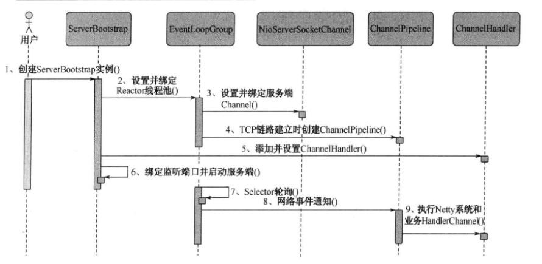
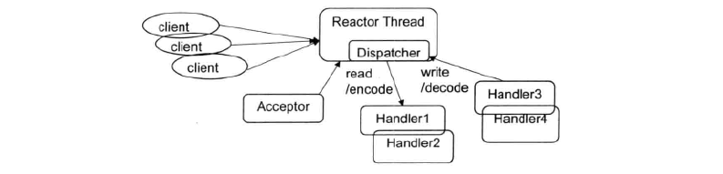
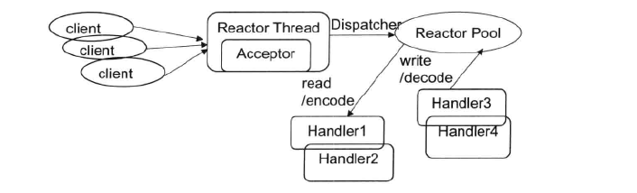
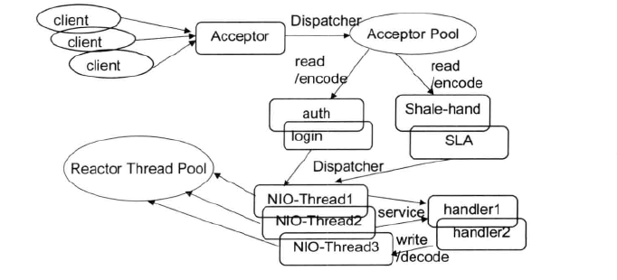

# Netty权威指南

## 粘包问题的解决策略

由于底层的TCP无法理解上层的业务数据，所以在底层是无法保证数据包不被拆分和重组的，这个问题只能通过上层的应用层协议栈设计来解决，根据业界的主流协议的解决方案，可以归纳如下：

- 消息定长，例如每个报文的大小为固定长度200字节，如果不够，空位补空格；
- 在包尾增加回车换行符进行分割，例如FTP协议；
- 将消息分为消息头和消息体，消息头中包含表示消息总长度（或者消息体长度）的字段，通常设计思路为消息头的第一个字段使用`int32`来表示消息的总长度；
- 更复杂的应用层协议。

为了解决TCP粘包/拆包导致的半包读写问题，Netty默认提供了多种编解码器用于处理半包，只要能熟练掌握这些类库的使用，TCP粘包问题从此变得非常容易，甚至不需要去关系它们，这也是其他NIO框架和JDK原生的NIO API所无法匹敌的。

TCP以流的方式进行数据传输，上层的应用协议为了对消息进行区分，往往采用如下4种方式：

- 消息长度固定，累计读取到长度总和为定长LEN的报文后，就认为读取了一个完整的消息；将计数器置位，重新开始读取下一个数据报；
- 将回车换行符作为消息结束符，例如FTP协议，这种方式在文本协议中应用比较广泛；
- 将特殊的分隔符作为消息的结束标志，回车换行符就是一种特殊的结束分隔符；
- 通过在消息头中定义长度字段来标示消息的总长度。

## WebSocket协议开发

长期以来存在着各种技术让服务器得知有新数据可用时，立即将数据发送给客户端。这些技术种类繁多，例如“推送”或Comet。最常见的一种黑客手段是对服务器发起连接创建假象，被称为长轮询。利用长轮询，客户端可以打开指向服务器的HTTP连接，而服务器一直保持连接打开，直到发送响应。服务器只要实际拥有新数据，就会发送响应。长轮询核其他技术都非常好用，在Gmail聊天应用中会经常使用它们。但是，这些解决方案都存在一个共同的问题：由于HTTP协议的开销，导致它们不适合用于低延迟应用。

为了解决这些问题，WebSocket将网络套接字引入到了客户端和服务器，浏览器和服务器之间可以通过套接字建立持久的连接，双方随时都可以互发数据给对方，而不是之前由客户端控制的请求——应答模式。

HTTP协议的主要弊端总结如下：

- HTTP协议为半双工协议。半双工协议指数据可以在客户端和服务器端两个方向上传输，但是不能同时传输。它意味着在同一时刻，只有一个方向上的数据传送；
- HTTP消息冗长而繁琐。HTTP消息包含消息头、消息体、换行符等，通常情况下采用文本方式传输，相比与其他的二进制通信协议，冗长而繁琐。
- 针对服务器推送的黑客攻击。例如长时间轮询。

传统的轮询模式需要浏览器不断向服务器发出其你去，然而HTTP请求的请求头冗长，可用数据非常低，会占用很多的带宽和服务器资源。比较新的一种轮询技术是Comet，使用了AJAX。这种技术虽然可达到双向通信，但依然需要发出请求，而且在Comet中，普遍采用了长连接，这也会大量消耗服务器带宽和资源。

为了解决HTTP协议效率低下的问题，HTML5定义了WebSocket协议，能更好的节省服务器资源和带宽并达到实时通信。

在WebSocket API中，浏览器和服务器只需要做一个握手的动作，然后，浏览器和服务器之间就形成了一条快速通道，两者可以直接互相传送数据。WebSocket基于TCP双向全双工进行消息传递，在同一时刻，既可以发送消息，也可以接收消息，相比HTTP的半双工协议，性能得到很大提升。

WebSocket的特点：

- 单一的TCP连接，采用全双工模式通信；
- 对代理、防火墙和路由器透明；
- 无头部信息、Cookie和身份验证；
- 无安全开销；
- 通过“ping/pong”帧保持链路激活；
- 服务器可以主动传递消息给客户端，不再需要客户端轮询。

## Netty服务端创建

**服务端创建时序图**

链路建立的时候创建并初始化ChannelPipeline。ChannelPipeline并不是NIO服务端所必需的，它本质就是一个负责处理网络事件的责任链，负责管理和执行ChannelHandler。网络事件以事件流的形式在ChannelPipeline中流转，由ChannelPipeline根据ChannelHandler的执行策略调度ChannelHandler的执行。典型的网络事件如下：

- 链路注册；
- 链路激活；
- 链路断开；
- 接收到请求消息；
- 请求消息接收并处理完毕；
- 发送应答消息；
- 链路发生异常；
- 发生用户自定义事件。

初始化ChannelPipeline完成之后，添加并设置ChannelHandler。ChannelHandler是Netty提供给用户定制和扩展的关键接口。利用ChannelHandler用户可以完成大多数的功能定制，例如消息编解码、心跳、安全认证、TSL/SSL认证、流量控制和流量整形等。Netty同时也提供了大量的系统ChannelHandler供用户使用，比较常用的系统ChannelHandler总结如下：

- 系统编解码框架——ByteToMessageCodec；
- 通用基于长度的半包解码器——LengthFieldBasedFrameDecoder；
- 码流日志打印Handler——LoggingHandler；
- SSL安全认证Handler——SslHandler；
- 链路空闲检测Handler——IdleStateHandler；
- 流量整形Handler——ChannelTrafficShapingHandler；
- Base64编解码——Base64Decoder和Base64Encoder。

TCP参数设置完成后，用户可以为启动辅助类和其父类分别制定Handler。两类Handler的用途不同：子类中的Handler是NioServerSocketChannel对应的ChannelPipeline的Handler；父类中的Handler是客户端新接入的连接SocketChannel对应的ChannelPipeline的Handler。

## ByteBuf功能说明

ByteBuffer完全可以满足NIO编程的需要，但是由于NIO编程的复杂性，ByteBuffer也有其局限性，它的主要缺点如下：

- ByteBuffer长度固定，一旦分配完成，它的容量不能动态扩展和收缩，当需要编码的POJO对象大于ByteBuffer的容量时，会产生索引越界异常；
- ByteBuffer只有一个标识位置的指针position，读写的时候需要手工调用flip()和rewind()等，使用者必须小心谨慎的处理这些API，否则很容易导致程序处理失败；
- ByteBuffer的API功能有限，一些高级和实用的特性它不支持，需要使用者自己编程实现。

**ByteBuf的工作原理**

ByteBuf依然是个Byte数组的缓冲区，它的基本功能应该与JDK的ByteBuffer一致。ByteBuf通过两个位置指针来协助缓冲区的读写操作，读操作使用readerIndex，写操作使用writerIndex。通常情况下，当我们对ByteBuffer进行put操作的时候，如果缓冲区剩余可写空间不够，就会发生BufferOverflowException异常。为了避免发生这个问题，通常在进行put操作的时候会对剩余可用空间进行校验。如果剩余空间不足，需要重新创建一个新的ByteBuffer，并将之前的ByteBuffer复制到新创建的ByteBuffer中，最后释放老的ByteBuffer。

从内存分配的角度看，ByteBuf可以分为两类：

- 堆内存（HeapByteBuf）字节缓冲区：特点是内存的分配和回收速度快，可以被JVM自动回收；缺点就是如果进行Socket的IO读写，需要额外做一次内存复制，将堆内存对应的缓冲区复制到内核Channel中，性能会有一定程度的下降；
- 直接内存（DirectByteBuf）字节缓冲区：非堆内存，它在堆外进行内存分配，相比于堆内存，它的分配和回收速度会慢一些，但是将它写入或者从Socket Channel中读取时，由于少了一次内存复制，速度比堆内存快。

正是因为各有利弊，所以Netty提供了多种ByteBuf供开发者使用，经验表明，ByteBuf的最佳实践是在**IO通信线程的读写缓冲区使用DirectByteBuffer，后端业务消息的编解码模块使用HeapByteBuf**，这样组合可以达到性能最优。

从内存回收角度看，ByteBuf也分为两类：基于对象池的ByteBuf和普通ByteBuf。两者的主要区别就是基于对象池的ByteBuf可以重用ByteBuf对象，它自己维护了一个内存池，可以循环利用创建的ByteBuf，提升内存的使用效率，降低由于高负载导致的频繁GC。测试表明**使用内存池后的Netty在高负载、大并发的冲击下内存和GC更加平稳**。

尽管推荐使用基于内存池的ByteBuf，但是内存池的管理和维护更加复杂，使用起来也需要更加谨慎，因此，Netty提供了灵活的策略供使用者来做选择。

## Channel的工作原理

Channel是Netty抽象出来的网路IO读写相关的接口，为什么不使用JDK NIO原生的Channel而要另起炉灶呢，主要原因如下：

- JDK的SocketChannel和ServerSocketChannel没哟统一的Channel接口供业务开发者使用，对于用户而言，没有统一的操作视图，使用起来并不方便。
- JDK的SocketChannel和ServerSocketChannel的主要职责就是网络IO操作，由于它们是SPI类接口，由具体的虚拟机厂家来提供，所以通过继承SPI功能类来扩展其功能的难度很大；直接实现ServerSocketChannel和SocketChannel抽象类，其工作量和重新开发一个新的CHannel功能类是差不多的；
- Netty的Channel需要能够跟Netty的整体架构融合在一起，例如IO模型、基于ChannelPipeline的定制模型，以及基于元数据描述配置化的TCP参数等，这些JDK的SocketChannel和ServerSocketChannel都没有提供，需要重新封装；
- 自定义的Channel，功能实现更加灵活。

基于上述四个原因，Netty重新设计了Channel接口，并且给予了很多不同的实现。它的设计原理比较简单，但是功能却比较复杂，主要的设计理念如下：

- 在Channel接口层，采用门面模式进行统一封装，将网络IO操作、网络IO相关联的其他操作封装起来，统一对外提供；
- Channel接口的定义尽量大而全，为SocketChannel和ServerSocketChannel提供统一的视图，由不同子类实现不同的功能，公共功能在抽象父类中实现，最大程度的实现功能和接口的重用；
- 具体实现采用聚合而非包含的方式，将相关的功能类聚合在Channel中，由Channel统一负责分配和调度，功能实现更加灵活。

## Reactor单线程模型

Reactor单线程模型，是指所有的IO操作都在同一个NIO线程上面完成。NIO线程的职责如下：

- 作为NIO服务端，接收客户端的TCP连接；
- 作为NIO客户端，向服务端发起TCP连接；
- 读取通信对端的请求或者应答信息；
- 向通信对端发送消息请求或者应答消息。

Reactor单线程模型如下图所示：

由于Reactor模式使用的是异步非阻塞IO，所有的IO操作都不会导致阻塞，理论上一个线程可以独立处理所有IO相关的操作。从架构层面看，一个NIO线程确实可以完成其承担的职责。例如，通过Acceptor类接收客户端的TCP连接请求消息，当链路建立成功之后，通过Dispatch将对应的ByteBuffer派发到指定的Handler上，进行消息解码。用户线程消息编码后通过NIO线程将消息发送给客户端。

在一些小容量应用场景下，可以使用单线程模型。但是这对于高负载、大并发的应用场景却不适合，主要原因如下：

- 一个NIO线程同时处理成百上千个的链路，性能无法支撑，即便NIO线程的CPU负荷达到100%，也无法满足海量消息的编码、解码、读取和发送；
- 当NIO线程负载过重之后，处理速度将变慢，这会导致大量客户端连接超时，超时之后往往会选择重发，这更加重了NIO线程的负载，最终会导致大量消息积压和处理超时，成为系统的性能瓶颈；
- 可靠性问题，一旦NIO线程意外跑飞，或者进入死循环，会导致整个系统通信模块不可用，不能接收和处理外部消息，造成节点故障。

为了解决这些问题，演进出了Reactor多线程模型。

## Reactor多线程模型

Reactor多线程模型的特点如下：

- 有专门一个NIO线程——Acceptor线程用于监听服务端，接收客户端的TCP连接请求；
- 网络IO操作——读、写等由一个NIO线程池负责，线程池可以采用标准的JDK线程池实现，它包含一个任务队列和N个可用的线程，由这些NIO线程负责消息的读取、解码、编码和发送；
- 一个NIO线程可以同时处理N条链路，但是一个链路只对应一个NIO线程，防止发生并发操作问题。

在绝大多数场景下，Reactor多线程模型可以满足性能需求。但是，在个别特殊场景中，一个NIO线程负责监听和处理所有的客户端连接可能会存在性能问题。例如并发百万客户端连接，或者服务端需要对客户端进行安全认证，但是认证本身非常损耗性能。在这种场景下，单独一个Acceptor线程可能会存在性能不足的问题，为了解决性能问题，产生了第三种Reactor线程模型——主从Reactor多线程模型。

## Reactor多线程模型

主从Reactor线程模型的特点是：服务端用于接收客户端连接的不再是一个单独的NIO线程，而是一个独立的NIO线程池。Acceptor接收到客户端TCP连接请求并处理完成后（可能包含接入认证等），将新创建的SocketChannel注册到IO线程池（sub reactor线程池）的某个IO线程上，由它负责SocketChannel的读写和编码工作。Acceptor线程池仅仅用于客户端的登录、握手和安全认证，一旦链路建立成功，就将链路注册到后端subReactor线程池的IO线程上，由IO线程负责后续的IO操作。

利用主从NIO线程模型，可以解决一个服务端监听线程无法有效处理客户端连接的性能不足问题。因此，**在Netty的官方Demo中，推荐使用该线程模型**。
